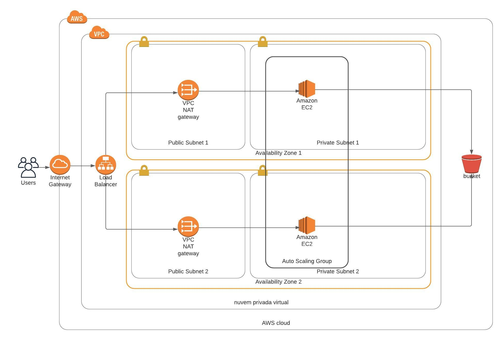

# Deploy a High Availability Website on AWS

This is a project from Udacity's DevOps Nanodegree program.

## Diagram

The project implements the bellow diagram using cloud formation.

## Accessing the website

The deployed website can be accessed on the following link:
[Udagram Website. It works!](http://final-WebAp-RRAZQXGOVORX-1862120965.us-west-2.elb.amazonaws.com)
